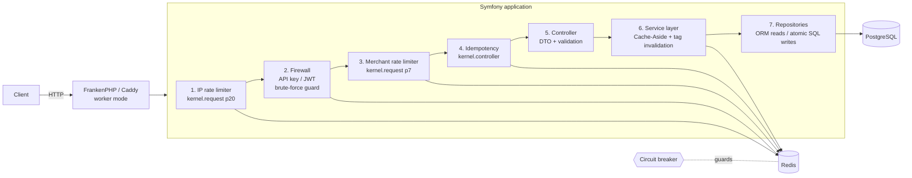

# Marketplace Seller API

> High-load public REST API for marketplace merchants: catalog, prices, warehouses and stock — with rate limiting, idempotent writes, tag-aware Redis caching and graceful degradation when Redis is down.

**Stack:** PHP 8.3 · Symfony 7.4 LTS · PostgreSQL 16 · Redis 7 · FrankenPHP (worker mode) · Doctrine ORM 3 · NelmioApiDocBundle (OpenAPI 3) · PHPUnit 11 · PHPStan level 8 · GitHub Actions

> This is a **portfolio project on synthetic data**. It demonstrates how I design and operate a public, multi-tenant API that has to survive retries, abusive clients, traffic spikes and infrastructure failures. It is not a copy of any production code.

---

## Business context

Marketplace sellers integrate their ERP / WMS systems with the platform through a public API: they push prices and stock levels many times a minute and read the catalog constantly. Such integrations are noisy by nature — clients retry on timeouts, run misconfigured loops, and one wrongly applied stock adjustment means an oversold item. The API therefore has to be **cheap to read, safe to retry, fair between merchants and resilient to partial outages**, and has to hold ~1k requests per second of mostly cached reads.

## Features

| Area | What is implemented |
|---|---|
| **REST API** | Products, prices (multi-currency, minor units), warehouses, stock per product/warehouse, pagination, search. Tenant isolation on every query. |
| **Security** | API keys (`X-API-Key`, HMAC-hashed with a pepper, constant-time compare) **and** short-lived JWT (`POST /auth/token`, HS256, iss/aud/exp validated). Brute-force protection per IP. RFC 9457 `problem+json` errors that never leak internals. |
| **Rate limiting** | Symfony RateLimiter on Redis: per-IP limiter *before* the firewall, per-merchant quota *after* it, `X-RateLimit-*` + `Retry-After` headers. |
| **Idempotency** | `Idempotency-Key` for POST/PUT/PATCH: atomic Redis lock, response replay, payload fingerprint check, concurrent duplicate → `409`. Mandatory for non-idempotent operations such as stock adjustments. |
| **Caching** | Cache-Aside on a tag-aware Redis pool, explicit invalidation matrix, stampede protection, negative caching, TTL as a safety net. |
| **Resilience** | One fail-fast Redis connection, active circuit breaker, defined degradation policy (see below), readiness probe. |
| **OpenAPI** | Generated from code by `nelmio/api-doc-bundle`: `/api/doc` (Swagger UI) and `/api/doc.json`. |
| **Quality** | 112 tests (unit + functional against real PostgreSQL and Redis), PHPStan 8, PHP-CS-Fixer, `composer audit`, CI with a production-image build. |

## Architecture



**Layers:** `Controller` (HTTP only: DTO mapping, status codes, OpenAPI attributes) → `Service` (use cases, caching, invalidation) → `Repository` (Doctrine ORM for reads, single atomic SQL statements for hot writes) → PostgreSQL. Cross-cutting concerns are event listeners, not code inside controllers: `RateLimitListener`, `IdempotencyListener`, `ApiExceptionListener`, `ApiAuthenticator`.

**Request pipeline** (the order is deliberate):

| # | Step | Why here |
|---|---|---|
| 1 | Per-IP rate limit (priority 20, before the firewall) | Sheds floods of anonymous/invalid traffic before any auth, DB or cache work. |
| 2 | Authentication | Peeks at the per-IP *failure* budget first; a blocked IP is refused before any key lookup. |
| 3 | Per-merchant rate limit (priority 7) | Needs the authenticated identity; protects fairness between merchants. |
| 4 | Idempotency (`kernel.controller`) | Replays by swapping the controller, so payload validation and business logic are skipped entirely. |
| 5–7 | Controller → Service → Repository | |

### Rate limiting

* **Policy:** sliding window per minute (`RATE_LIMIT_IP`, `RATE_LIMIT_MERCHANT`), counters in Redis, locks through the Symfony Lock component.
* **Two scopes:** per IP (everything under `/api`, health probes exempt) and per merchant id (independent of how many IPs a merchant uses).
* **Brute force:** a dedicated `fixed_window` limiter counts only **failed** authentications per IP (`RATE_LIMIT_AUTH_FAILURES` per 15 minutes). The guard *peeks* with `consume(0)` before authenticating and spends a token only after a rejected credential, so legitimate clients never touch the budget. A blocked IP gets `429` even with a valid key.
* **Headers:** `X-RateLimit-Limit`, `X-RateLimit-Remaining`, `X-RateLimit-Reset` (only when exhausted) and `Retry-After` on `429`.

### Idempotency protocol

1. Same key, finished before → **replay** the stored 2xx response (`Idempotent-Replayed: true`); the payload fingerprint (method + path + query + body) must match, otherwise `422`.
2. Same key, another request in flight → `409` + `Retry-After: 1`.
3. New key → claim it with an atomic `SET NX EX 30`, run the handler, **store the response and only then release the lock** (compare-and-delete Lua script).

The ordering "save, then release" plus a *double check after acquiring the lock* closes the race where a request wins the lock right after the previous owner finished. Only successful (2xx) responses are stored: failures produced no side effects, so a retry is allowed to re-execute. Keys are scoped per merchant and kept 24 h. Stock adjustments **require** the header — a retried `+5` must never become `+10`.

### Caching (Cache-Aside + tags)

* Read path: `CatalogCache::remember(key, tags, ttl, loader)` over `RedisTagAwareAdapter`; Symfony's `get()` adds stampede protection (lock + probabilistic early expiry). Cached values are normalized **arrays**, not PHP-serialized objects, so deploys never break the cache.
* Write path: **commit first, then invalidate by tags**. The TTL (60 s – 10 min) bounds the tiny window in which a concurrent reader can re-populate stale data.

| Write | Invalidated tags |
|---|---|
| product created | `merchant.<m>.products` |
| product updated | `product.<id>`, `merchant.<m>.products` |
| product deleted | `product.<id>`, `stock.<id>`, `merchant.<m>.products` |
| price changed | `product.<id>`, `merchant.<m>.products` (prices are embedded in product views) |
| stock changed | `stock.<id>` |
| warehouse created | `merchant.<m>.warehouses` |
| warehouse updated / deleted | `warehouse.<id>`, `merchant.<m>.warehouses` |

Stock views get one extra `warehouse.<id>` tag per warehouse they mention (tags derived from the loaded value), so renaming a warehouse refreshes every stock view that shows it.
Merchant identities (the authentication hot path) are cached for 60 s as well, so authenticating a request normally costs **zero** DB queries. Redis runs with `volatile-lru`: the tag-aware adapter requires `noeviction`/`volatile-*` — never `allkeys-*`.

### Stock consistency

Stock writes are **single atomic SQL statements** (`INSERT … ON CONFLICT DO UPDATE … WHERE quantity + :delta >= 0 RETURNING quantity`), never read-modify-write through the ORM. PostgreSQL row locks serialise writers of one (product, warehouse) pair; a `CHECK` constraint is the last line of defence. `scripts/concurrency-check.sh` proves it black-box: 40 parallel write-offs against 10 units succeed exactly 10 times.

### Resilience: what happens when Redis is down?

Redis is an accelerator and a guard, **not** the source of truth, and the policy is explicit:

| Component | Redis unavailable → |
|---|---|
| Reads / cache | served from PostgreSQL |
| Writes | succeed; cache invalidation is skipped, entries expire by TTL (≤ 10 min) |
| Rate limiting, brute-force guard | **fail-open** (availability over strictness; keys have 192 bits of entropy) |
| `Idempotency-Key` requests | **fail-closed** → `503` + `Retry-After`; the client asked for exactly-once, so a silent duplicate would be worse than a retry |
| `/api/v1/health` | `503 degraded` |

Two real problems found by killing Redis under a running container are handled in code:

1. **phpredis retries a lost connection 10× with back-off** — the first command after the loss blocked ~39 s. `FailFastRedis` disables driver retries (`OPT_MAX_RETRIES=0`).
2. **A dead phpredis handle never recovers on its own**, and Symfony's cache adapters *swallow* connection errors, so the app never sees an exception to count. `RedisCircuitBreaker` therefore probes Redis actively (≤ once per 2 s healthy, once per 5 s broken), shares its state through APCu, and re-opens each worker's connection once per outage ("generation").

Measured on a laptop with the production image: ~5 ms per cached request while healthy, **~5 ms during the outage** (no stall), automatic recovery within one cooldown window.

## API overview

All endpoints live under `/api/v1`. Full schema: `/api/doc` (Swagger UI) or `/api/doc.json`.

| Method & path | Description | Idempotency-Key |
|---|---|---|
| `POST /auth/token` | Exchange an API key for a JWT (public, brute-force guarded) | – |
| `GET /health` | Readiness: PostgreSQL + Redis (public, not rate limited) | – |
| `GET /products` | List (`page`, `per_page`, `q`, `active`), cached | – |
| `POST /products` | Create | optional |
| `GET / PUT / DELETE /products/{id}` | Read (cached) / replace / delete | optional on PUT |
| `GET /products/{id}/prices` | Prices of a product | – |
| `PUT / DELETE /products/{id}/prices/{currency}` | Set / remove a price (minor units) | optional on PUT |
| `GET /products/{id}/stock` | Stock per warehouse + total (cached, 60 s) | – |
| `PUT /products/{id}/stock/{warehouseId}` | Set absolute quantity | optional |
| `POST /products/{id}/stock/{warehouseId}/adjustments` | Apply a signed delta, never below zero | **required** |
| `GET / POST /warehouses`, `GET / PUT / DELETE /warehouses/{id}` | Warehouses (cached) | optional on POST/PUT |

Errors are `application/problem+json`:

```json
{"type":"urn:seller-api:error:insufficient_stock","title":"Conflict","status":409,
 "detail":"Not enough stock in this warehouse for the requested write-off.","code":"insufficient_stock"}
```

## Quick start

Requirements: Docker with Compose. Nothing else is needed (no local PHP).

```bash
docker compose up -d --build          # API on http://localhost:8080, migrations run automatically
docker compose exec app php bin/console app:demo:seed     # demo merchant + 100 products; prints an API key
# or: docker compose exec app php bin/console app:merchant:create "Acme Ltd"

export KEY=sk_...                      # the key printed above
curl -H "X-API-Key: $KEY" "http://localhost:8080/api/v1/products?per_page=2"

# exchange for a JWT and use it
TOKEN=$(curl -s -X POST localhost:8080/api/v1/auth/token -H 'Content-Type: application/json' \
        -d "{\"api_key\":\"$KEY\"}" | sed -E 's/.*"access_token":"([^"]+)".*/\1/')
curl -H "Authorization: Bearer $TOKEN" http://localhost:8080/api/v1/warehouses

# an idempotent stock adjustment: send it twice, it is applied once
curl -X POST -H "X-API-Key: $KEY" -H 'Idempotency-Key: receipt-2026-0001' -H 'Content-Type: application/json' \
     -d '{"delta": 5}' "http://localhost:8080/api/v1/products/<productId>/stock/<warehouseId>/adjustments"
```

Swagger UI: <http://localhost:8080/api/doc>. `make help` lists the shortcuts (`make up`, `make test`, `make qa`, `make seed`, …).

## Tests & quality

```bash
make test          # unit + functional (starts PostgreSQL and Redis through docker compose)
make qa            # PHP-CS-Fixer + PHPStan level 8 + tests (what CI runs)
make concurrency KEY=sk_...   # parallel duplicate / oversell proof against the running API
```

* **Functional tests (`WebTestCase`)** run against the **real** PostgreSQL and Redis: every endpoint, validation, tenant isolation, authentication (API key, JWT, tampered/expired tokens, deactivated merchants), brute-force blocking, per-merchant and per-IP rate limiting with headers, idempotency (replay, mismatch, in-flight conflict, failures not stored, per-merchant scoping), cache hits/invalidation/tag behaviour, OpenAPI document, and a **Redis outage** suite asserting the degradation policy above.
* **Isolation without cleanup:** each test creates its own merchant and calls the API from a random IP, so rate-limiter buckets, cache keys and idempotency keys never collide. `.env.test` uses tiny limits (20 req/min per merchant, 50 per IP, 3 failed logins) to make throttling observable.
* **Unit tests:** API keys, JWT, idempotency protocol (in-memory store, including the lost-race branch), cache facade (including a broken pool), circuit breaker, fail-fast connection.

CI (`.github/workflows/ci.yml`): code quality (composer validate/audit, CS-Fixer, PHPStan) → tests with PostgreSQL + Redis service containers and a Doctrine schema validation → production image build with a container lint.

### Load testing

`loadtest/read-heavy.js` is a k6 profile (≈90 % cached reads, ≈10 % idempotent stock adjustments). The per-merchant quota applies, so for raw throughput raise `RATE_LIMIT_*` or spread load over several merchants (`API_KEYS=a,b,c`). **No throughput figures are claimed here:** the target of ~1k RPS is a design goal (stateless workers, cached reads, no per-request DB work on the hot path) and should be measured on your own hardware.

```bash
k6 run -e API_KEYS=sk_a,sk_b,sk_c -e RATE=900 -e WRITE_RATE=100 loadtest/read-heavy.js
```

## Project structure

```
.
├── .github/workflows/ci.yml        # quality → tests → production image
├── config/                         # Symfony config (security, cache, rate_limiter, nelmio, services)
├── docker/                         # Caddyfile (FrankenPHP), php.ini, entrypoint
├── loadtest/read-heavy.js          # k6 profile
├── migrations/                     # schema + CHECK constraints
├── scripts/concurrency-check.sh    # parallel exactly-once / no-oversell proof
├── src/
│   ├── Cache/                      # CatalogCache (Cache-Aside facade), CacheTags (keys & invalidation matrix)
│   ├── Command/                    # app:merchant:create, app:demo:seed
│   ├── Controller/Api/V1/          # Auth, Product, Price, Warehouse, Stock, Health
│   ├── Dto/{Request,Response}/     # validated input / documented output
│   ├── Entity/                     # Merchant, Product, ProductPrice, Warehouse, StockLevel
│   ├── EventListener/              # ApiExceptionListener (problem+json)
│   ├── Exception/ApiException.php
│   ├── Http/                       # ProblemResponseFactory, ViewNormalizer
│   ├── Idempotency/                # listener, service, Redis store, attribute
│   ├── RateLimit/RateLimitListener.php
│   ├── Redis/FailFastRedis.php
│   ├── Repository/                 # ORM reads, atomic SQL writes
│   ├── Resilience/RedisCircuitBreaker.php
│   ├── Security/                   # ApiAuthenticator, ApiKeyService, JwtTokenService, BruteForceGuard, …
│   └── Service/                    # Product, Price, Warehouse, Stock, Auth use cases
├── tests/{Unit,Functional,Support}
├── Dockerfile                      # base → dev → prod (worker mode, opcache, warmed cache)
└── docker-compose.yml              # app + PostgreSQL + Redis
```

## Configuration

| Variable | Default (dev) | Meaning |
|---|---|---|
| `DATABASE_URL` | compose Postgres | PostgreSQL DSN |
| `REDIS_URL` | `redis://redis:6379?timeout=0.5&read_timeout=0.5` | Single Redis; keep timeouts short |
| `JWT_SECRET` / `JWT_TTL` | dev value / `900` | HS256 secret (≥ 32 bytes), token lifetime in seconds |
| `API_KEY_PEPPER` | dev value | Server-side pepper for API key HMAC. Rotating it invalidates all keys. |
| `RATE_LIMIT_IP` / `RATE_LIMIT_MERCHANT` | `1200` / `6000` | Requests per minute |
| `RATE_LIMIT_AUTH_FAILURES` | `10` | Failed authentications per IP per 15 min |
| `TRUSTED_PROXIES` | private ranges | Reverse proxies whose `X-Forwarded-*` headers are trusted |

Dev defaults are committed for convenience; **every secret must come from a secret manager in any real environment**.

## Design trade-offs & known limitations

* **Coarse invalidation:** a price change invalidates the merchant's whole product *list* tag. Simple and always correct; at very high write rates per merchant a generation/version key would be cheaper.
* **Staleness window:** invalidation happens after commit; entries that could not be invalidated (Redis outage) live until their TTL.
* **Idempotency storage is Redis-only:** a Redis flush forgets keys inside their 24 h window. For payments-grade guarantees persist the key in the same database transaction as the operation (outbox-style).
* **Lock TTL (30 s):** a handler running longer than the lock TTL loses exclusivity.
* **Per-IP brute-force budget** can lock out clients behind a shared NAT; a per-key budget would let attackers lock out a merchant. The 192-bit secret makes guessing infeasible, the guard is defence in depth and load shedding.
* **No merchant management API / admin UI** — merchants are created with a console command by design (out of scope).
* **Single region, single Redis:** no Sentinel/Cluster; the breaker and degradation policy are what make a Redis failure survivable.

## License

MIT
